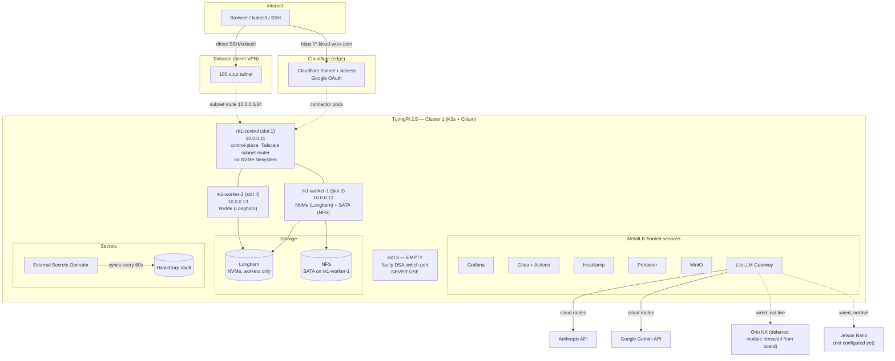

# TuringPi Homelab

A fully automated, self-hosted homelab cluster built on TuringPi 2.5
hardware — Kubernetes (K3s + Cilium), replicated block storage, a
production-style secrets pipeline, and a self-hosted AI gateway, all
provisioned from this repo via Ansible and exposed to the internet with
zero open inbound ports.

**Live status**: Cluster 1 (TuringPi 2.5 + 3× RK1) is fully built and
verified end-to-end. Cluster 2 (TuringPi 2 + CM4) and the standalone Jetson
Nano/Orin NX nodes are future work — see [Known Limitations](#known-limitations).

## Overview

**Tech stack**
- **Kubernetes**: [K3s](https://k3s.io/) v1.30.5 + [Cilium](https://cilium.io/) CNI (replaced an earlier kubeadm+Flannel build)
- **Storage**: [Longhorn](https://longhorn.io/) (replicated block storage on NVMe), NFS (SATA), [MinIO](https://min.io/) (S3-compatible)
- **Secrets**: [HashiCorp Vault](https://www.vaultproject.io/) + [External Secrets Operator](https://external-secrets.io/) (syncs Vault → Kubernetes Secrets)
- **Networking**: [MetalLB](https://metallb.universe.tf/) (LoadBalancer IPs), [ingress-nginx](https://kubernetes.github.io/ingress-nginx/), [Cilium](https://cilium.io/) (CNI + pod networking)
- **Remote access**: [Tailscale](https://tailscale.com/) (direct node SSH/kubectl, control-plane only), [Cloudflare Tunnel](https://www.cloudflare.com/products/tunnel/) + Access (public web UIs, zero open ports)
- **AI gateway**: [LiteLLM](https://www.litellm.ai/) (unified OpenAI-compatible API, routes to Anthropic/Gemini cloud APIs today; local Ollama routes are wired but not live — see Limitations)
- **Dev tooling**: [Gitea](https://gitea.io/) + Actions CI/CD
- **Observability**: [Prometheus](https://prometheus.io/) + [Grafana](https://grafana.com/), [Headlamp](https://headlamp.dev/) and [Portainer](https://www.portainer.io/) for K8s UIs
- **Automation**: [Ansible](https://www.ansible.com/) (every layer is a role/playbook), driven by a single `Makefile`

### Architecture



## Hardware Requirements

- **TuringPi 2.5** carrier board + BMC
- **3× Turing RK1** compute modules, populated in **slots 1, 2, and 4 only**
  — **slot 3 has a permanently faulty DSA switch port and must never be
  used** (diagnosed via `tcpdump`; nodes placed there cannot communicate
  with the rest of the cluster)
- **NVMe SSD per RK1** — 1TB+ recommended. In this build, `rk1-worker-1` and
  `rk1-worker-2` each have a live, formatted ~954GB NVMe backing Longhorn;
  `rk1-control`'s NVMe is physically present but currently unpartitioned
  (see Limitations)
- **Mini-PCIe SATA adapter** in slot 2 (`rk1-worker-1`) — carries the SATA
  SSD used for NFS
- **SATA SSD**, 476GB+, connected via the mini-PCIe adapter above — backs
  the NFS export
- **Network**: a router/gateway that supports static IP assignment on a
  `10.0.0.0/24`-style range; this repo assumes `10.0.0.0/24` throughout

## Network Layout

```
10.0.0.1          Router / gateway
10.0.0.10         Cluster 1 BMC (tpi1-bmc)
10.0.0.11         rk1-control   (slot 1) — also Tailscale subnet router
10.0.0.12         rk1-worker-1  (slot 2) — also NFS server
10.0.0.13         rk1-worker-2  (slot 4)
                  slot 3 — EMPTY / FAULTY, never assign a node here
10.0.0.15         jetson-nano   (standalone, not yet configured)
10.0.0.30-49      MetalLB LoadBalancer pool (Cluster 1)
10.0.0.100-199    DHCP pool (router managed)
```

Cluster 2 (TuringPi 2 + CM4, `10.0.0.20-24`) and TrueNAS (`10.0.0.5`) are
planned but not built yet — see [Known Limitations](#known-limitations).

**MetalLB pool**: `10.0.0.30-10.0.0.49` (20 IPs) — 7 currently assigned, see
[Services](#services) below.

**Cloudflare Tunnel architecture**: `cloudflared` connector pods run
in-cluster and open an *outbound* connection to Cloudflare's edge — no
inbound ports are opened on the router. Cloudflare Access sits in front of
every hostname and enforces Google OAuth login before traffic ever reaches
the tunnel. DNS for all `*.kloud-worx.com` hostnames is managed entirely by
the `cloudflare-tunnel` Ansible role.

## Prerequisites

- WSL2 Ubuntu 24.04 (or native Linux) as your workstation
- Tools: [`tpi`](https://docs.turingpi.com/docs/turing-pi2-tpi-cli) (BMC CLI), `ansible`, `kubectl`, `helm` — `make setup` installs what it can automatically
- A [Tailscale](https://tailscale.com/) account (free tier is enough)
- A [Cloudflare](https://www.cloudflare.com/) account with a domain you control
- A GitHub account (to fork/clone this repo)
- Vault CLI is optional — `kubectl exec vault-0 -n vault -- vault ...` works without installing it locally

## Quick Start

Run these from the repo root, in order. Each step is idempotent — safe to
re-run.

```bash
# 1. Flash Ubuntu 22.04 to all 3 RK1 nodes via the BMC
make flash

# 2. Bootstrap: SSH keys, hostnames, static IPs
make bootstrap

# 3. Harden and prep every node (UFW, fail2ban, NTP, swap disable)
make common

# 4. Deploy K3s (server + agents) + Cilium CNI
make kubernetes

# 5. Storage: Longhorn (NVMe) + NFS (SATA) + MinIO
make storage

# 6. Cluster add-ons: MetalLB, ingress-nginx, Prometheus/Grafana, Headlamp, Portainer
make addons

# 7. Secrets backend: HashiCorp Vault + External Secrets Operator
make vault

# 8. Populate Vault with your API keys (interactive)
make secrets

# 9. AI gateway: LiteLLM
make ai-stack

# 10. Dev tooling: Gitea + Actions CI/CD
make dev-tools

# 11. Remote access — Tailscale (control-plane only, see Limitations)
make tailscale

# 12. Public web UIs — Cloudflare Tunnel
make cloudflare
```

`make build` chains steps 3-6 into one command; `make build-all` chains
`build` + `ai-stack` + `dev-tools`. See `make help` for the full target
list, and [`docs/day0-runbook.md`](docs/day0-runbook.md) for a more
detailed walkthrough of the same sequence.

## Services

| Service | LAN IP | Public URL |
|---|---|---|
| ingress-nginx | http://10.0.0.30 | — |
| MinIO | http://10.0.0.35 | https://minio.kloud-worx.com |
| Gitea | http://10.0.0.36:3000 | https://gitea.kloud-worx.com |
| Grafana | http://10.0.0.37 | https://grafana.kloud-worx.com |
| Headlamp | http://10.0.0.38 | https://headlamp.kloud-worx.com |
| Portainer | http://10.0.0.39 | https://portainer.kloud-worx.com |
| LiteLLM Gateway | http://10.0.0.40/v1 | https://litellm.kloud-worx.com |
| Vault | *(ClusterIP only — see Operations)* | https://vault.kloud-worx.com |

All public URLs above are Cloudflare Access-protected (Google OAuth).

**Reserved, not yet deployed**: `prefect.kloud-worx.com`,
`jupyter.kloud-worx.com` (DNS/Access records exist, no workload behind them
yet), `llm.kloud-worx.com` (Open WebUI, deferred — see Limitations).

## Operations

- **Troubleshooting**: [`docs/runbook.md`](docs/runbook.md) — severity-ordered
  playbook for the 20 most common failure modes this cluster has actually
  hit, with detection commands, root causes, and fixes.
- **Health check**: `make cluster-health` — nodes, pods, PVCs, Longhorn
  volume health, MetalLB pool usage, swap, and eMMC usage in one pass
  (`make health` also exists as a lighter/older check).
- **Graceful power cycling**: `make cluster-shutdown` / `make cluster-startup`
  — cordons/drains, verifies Longhorn volumes detach cleanly, powers nodes
  off/on via the BMC in the correct order, and re-verifies cluster health on
  the way back up. Supports `--dry-run`.
- **Vault unseal**: Vault re-seals on every pod restart — run
  `make vault-unseal` afterward (reads `~/.vault-init.json`, **back this
  file up**, it's the only copy of the unseal keys).

## Known Limitations

- **Slot 3's DSA switch port is permanently faulty** — never assign a node
  there. Diagnosed with `tcpdump` after nodes placed there couldn't reach
  the rest of the cluster.
- **Tailscale runs on the control plane only** — installing it on the
  workers previously hijacked their LAN routing (`--accept-routes` combined
  with an advertised subnet the workers were already natively on broke
  plain SSH/kubelet connectivity while the tunnel itself stayed up). See
  `docs/runbook.md` before ever re-enabling it on a worker.
- **`rk1-control` has no NVMe filesystem** — the NVMe module is physically
  present but unpartitioned/unmounted, so K3s's own data (`/var/lib/rancher`)
  stays on eMMC there. Not currently a problem (eMMC usage is well under
  70%), but it means the control-plane node can't host Longhorn replicas or
  benefit from the NVMe symlink migration the workers use.
- **LiteLLM's UI requires PostgreSQL**, which isn't deployed yet — spend
  tracking and user/team management return "not connected to DB" until a
  Postgres backend is added (tracked in `CLAUDE.md`'s Future Enhancements
  Backlog).
- **Anthropic and Gemini API keys are placeholders** — `make secrets` must
  be re-run with real keys before LiteLLM's cloud model routes will
  actually authenticate.

## Repository Structure

```
turingpi-homelab/
├── CLAUDE.md                    # Full project context (hardware, state, conventions)
├── SESSION-HANDOFF.md           # Running session log — read this to pick up where work left off
├── Makefile                     # Every operation as a make target (make help for the list)
├── ansible/
│   ├── inventory/
│   │   ├── hosts.yml            # Node definitions and IPs
│   │   └── group_vars/all/vars.yml  # All variables (IPs, versions, sizes)
│   ├── playbooks/                # 00-bootstrap through 11-cloudflare-tunnel
│   └── roles/                    # One role per service: common, k3s-server,
│                                  # k3s-agent, longhorn, nfs-server, minio,
│                                  # litellm, vault, external-secrets,
│                                  # tailscale, cloudflare-tunnel, gitea, ...
├── scripts/
│   ├── workstation/setup.sh      # New machine setup
│   ├── bmc/bmc-power.sh          # Node power control via BMC
│   ├── os-flash/                 # flash-rk1.sh, discover-nodes.sh
│   ├── secrets/setup-api-keys.sh # Interactive Vault secret population
│   └── maintenance/
│       ├── health-check.sh       # Basic cluster health check
│       ├── cluster-lifecycle.sh  # shutdown / startup / health-check, --dry-run
│       └── teardown.sh           # K3s-native cluster reset
├── kubernetes/
│   └── helm-values/              # Helm chart value overrides (e.g. Grafana)
├── docs/
│   ├── day0-runbook.md           # Full setup guide
│   ├── runbook.md                # Operational troubleshooting playbook
│   └── medium-series-outline.md  # Planned Medium article series
└── cluster2/                     # TuringPi 2 + CM4 cluster — future, not started
```
